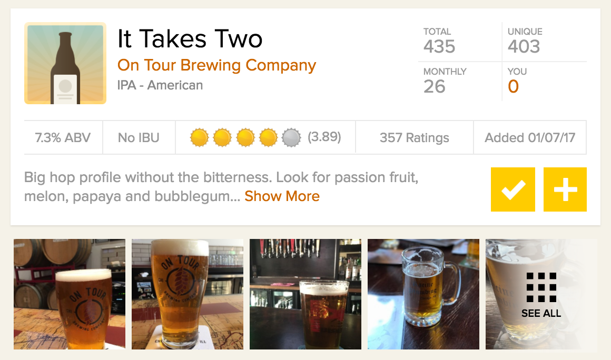

# The Great and Wonderful Beer Machine!

This repo contains my work on my final project for General Assembly Chicago's Data Science Immersive course.

Follow [this link](https://docs.google.com/presentation/d/1cBRxQ0HISlL-w3Uk-jA8-sT_vh4mauoVNyxiYdz6BEI/edit#slide=id.g20587fea3d_0_90) to the slide deck for the lightning talk on this project.

Follow [this link](https://docs.google.com/presentation/d/1RSJRFbe7qADO_zXJZrREWm1V3cR3lXyKqQ7AeIIEp6w/edit#slide=id.g217cb0fabd_0_801) to the slide deck for the capstone presentation.

## Project Elements
- Data Acquisition
- Data Cleaning and Database Construction
- Exploratory Data Analysis
- Feature Engineering and Modeling
- Model Productionalization

### Goal:,
For my project, I will build a model that can accurately predict how a beer will be rated on the social media platform, Untappd. As seen in the pane below, a beer's average rating is on a scale of 0.25 - 5.0 (a beer cannot actually be rated zero).

### Methodology:,
In order to acquire my data, I will be scraping every unique beer page on Untappd and the corresponding brewery pages for both the average ratings of those beers and information about them with which to generate predictive features. I am using a combination of the [Requests](http://docs.python-requests.org/en/master/) and [Beautiful Soup](https://www.crummy.com/software/BeautifulSoup/bs4/doc/) libraries. Given the size of my data, I have thus far been storing it in CSVs, but I am considering setting up a PostgreSQL database if necessary.

Given that I am attempting to predict a rating, I intend implement a variety of regression models and compare their performance using [Scikit-Learn](http://scikit-learn.org/stable/), a premier machine learning library. The ease of interpreting a model is a recurring concern in machine learning applications. The transparency of a regularized linear regresssion is ideal for ascertaining the precise relationship a given feature has with the target variable and the relative significance features have compared to one another. Ensemble modeling techniques--like Random Forests and Gradient Boosted Regression--often provide greater accuracy at the expense of transparency. Depending on the relative strength of the model, I will weigh accuracy against opacity in determining the final model to use.

### The Data:,
Below, you will find preliminary data analysis performed on the first 150,000 rows of data scraped from Untappd. I am currently in the process of scraping through all of the 2,000,000 rows. Given that the data is user-generated--by both consumers as well as breweries and venues--there is significant risk of messy data. I am also assuming that the features gleaned from Untappd--beer style, abv, ibu, number of check-ins, number of ratings, brewery location, etc--will be predictive of a beer's rating. ,

Should these features prove insufficient, I see a few alternative paths forward:,
1. Engineering more features, potentially with data from other sources, and entity matching those features to the existing entries,
2. Drawing a threshold of high-rated vs. low-rated and experimenting with classification algorithms,
3. Subset the data as necessary to improve the results or the viability of either option 1 or 2

### Success Criterion:,
A successful project will culminate in a model with a robust r^2 score on data it has never before seen, indicating that it can predict the scores a new beer will have before that beer is rated.
